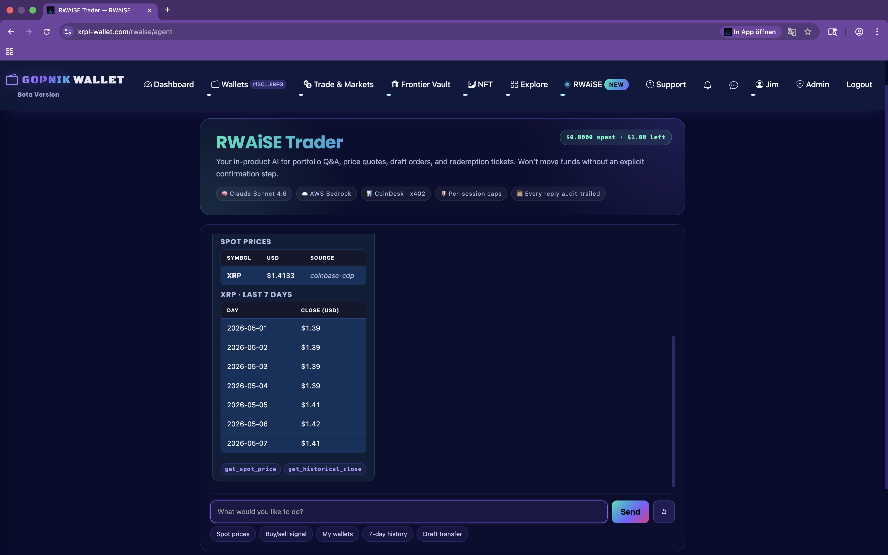
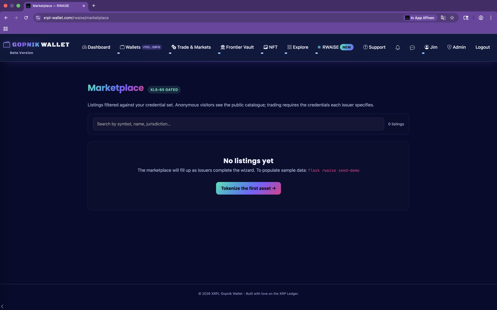
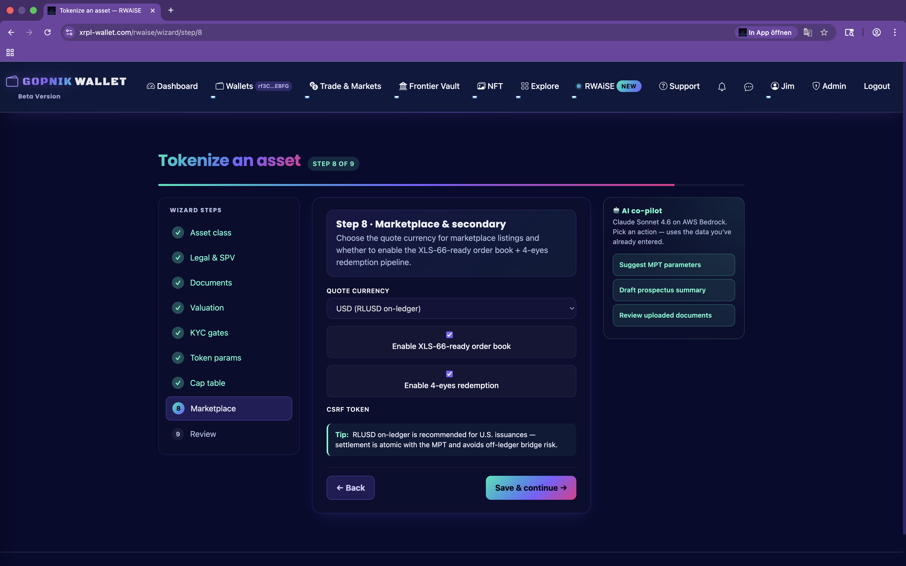
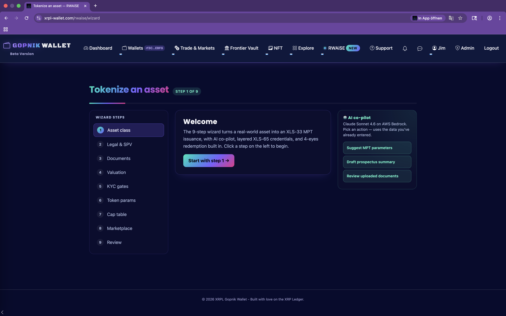
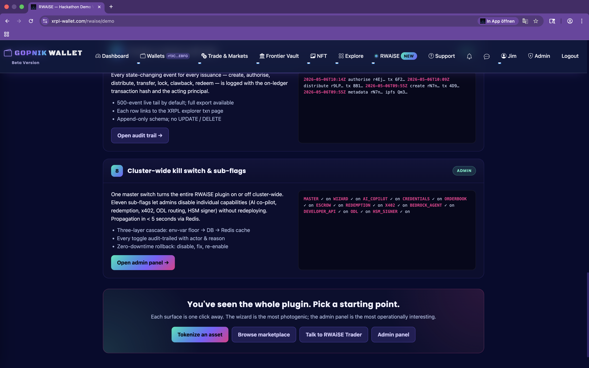
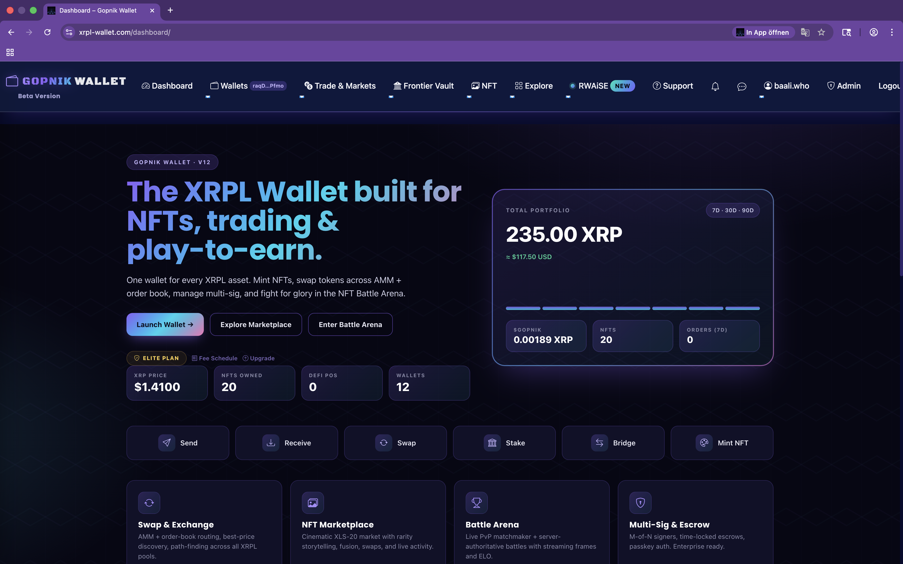
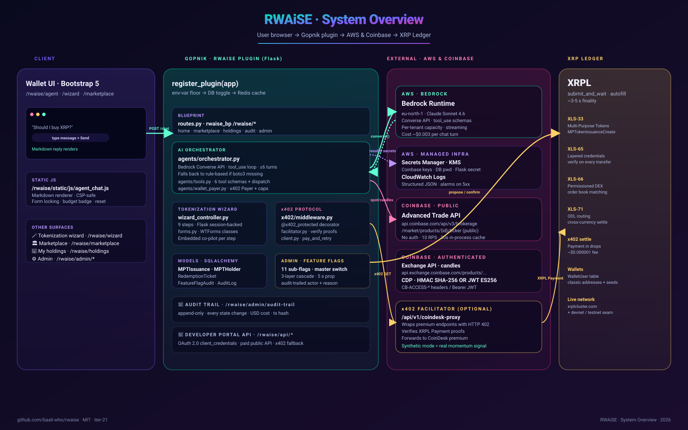

<div align="center">

# 🪙 RWAiSE — Real-World Asset Issuance & Settlement Engine

### Tokenize, trade, and trade-with-AI any real-world asset on the **XRP Ledger**.

[](LICENSE)
[](https://xrpl.org/)
[](https://aws.amazon.com/bedrock/)
[](https://x402.org/)
[](https://python.org/)

**RWAiSE** is a Flask plugin for the [Gopnik wallet](https://www.xrpl-wallet.com) that turns illiquid real-world assets into XRPL **Multi-Purpose Tokens** (XLS-33), enforces compliance with **layered credentials** (XLS-65), settles redemption with **4-eyes review**, exposes paid public APIs over **HTTP 402** (the x402 protocol), and ships an **in-product AI agent** that researches markets and proposes XRPL transactions on the user's behalf — with explicit confirmation gates between Claude and your XRP.

</div>

---

## 📺 Demo

> **🔗 Live demo:**  https://youtu.be/Qaf6jOLWOgI
> **🎥 Video walkthrough:** *[(https://youtu.be/Qaf6jOLWOgI)*
> **📊 Pitch deck:** *[(https://canva.link/sibb8p4ddhugfvn)]*
> **🐦 Twitter thread:** *[https://x.com/BaaliWho]*


<div>








</div>
FIND MORE MEDIA IN DOCS FOLDER!!! 
<div align="center">

| 9 | 11 | 6 | XLS-33 | XLS-65 | x402 |
|:-:|:--:|:-:|:------:|:------:|:----:|
| Wizard steps | Sub-flags | AI agent tools | MPTs | Credentials | Pay-per-call |

</div>
---

## ✨ What it does

| | |
|---|---|
| 🧙 **9-step tokenization wizard** | Issuer flow: asset class → SPV → cap-table CSV → on-ledger `MPTokenIssuanceCreate`. Embedded AWS Bedrock Claude co-pilot suggests parameters and reviews documents. |
| 🏛 **Cap-table-aware marketplace** | Listings filtered against the visiting wallet's XLS-65 credential set. Anonymous browse, credentialed trade. XLS-66-ready under the hood. |
| 🔐 **XLS-65 credential issuer** | "Verified investor", jurisdiction, accreditation, asset-class credentials issued on-chain by trusted parties. Re-checked on every transfer. |
| 🔄 **4-eyes redemption pipeline** | Investor files → 2-admin approval → `MPTokenIssuanceDestroy` + fiat off-ramp. Held in escrow during review. Settles via XLS-71 ODL when configured. |
| 🤖 **RWAiSE Trader (AI agent)** | Bedrock Claude with 6 tools: real Coinbase market data, paid x402 signals, wallet listing, propose/confirm XRPL transfers. Per-call + per-session spending caps. |
| 💸 **x402 paid public API** | Developer-facing API that other agents can call and pay per request via HTTP 402 — settled in XRP/RLUSD on the XRP Ledger. |
| 🛡 **3-layer feature flags** | env-var floor → DB toggle → Redis cache. 11 sub-flags, 5-second cluster-wide propagation, audit-trailed. |
| 📜 **Append-only audit trail** | Every state-changing event with on-ledger tx hash. Visible at `/rwaise/admin/audit-trail`. |

---

## 🏗 Architecture at a glance

<div align="center">



</div>

**Four lanes from left to right:**

1. **User browser** — Flask templates, Bootstrap 5, the chat UI at `/rwaise/agent`.
2. **RWAiSE plugin** — `gopnik/rwaise/` mounted on the host wallet's Flask app. Master switch + 11 sub-flags. Tokenization wizard, marketplace, AI orchestrator.
3. **External services (AWS + Coinbase)** — Bedrock Claude Sonnet 4.6 (Converse API + tool_use), Coinbase Developer Platform (real market data + optional x402 facilitator).
4. **XRP Ledger** — XLS-33 MPTs, XLS-65 credentials, XLS-66 permissioned DEX, XLS-71 ODL routing, x402 settlement in drops.

Detailed diagrams:
- [📐 System overview](docs/architecture/01-system-overview.svg) · what calls what
- [☁️ AWS module map](docs/architecture/02-aws-modules.svg) · every AWS service grouped
- [🤖 AI agent flow](docs/architecture/03-ai-agent-flow.svg) · 10-step trace of "should I buy XRP?"
- [💸 x402 sequence](docs/architecture/04-x402-sequence.svg) · 402 → pay → 200 dance with the XRPL
- [🧩 Class diagram](docs/architecture/05-class-diagram.svg) · modules + classes + connections

Full text walkthrough: [`docs/ARCHITECTURE.md`](docs/ARCHITECTURE.md)

---

## 📦 Module map

```
gopnik/rwaise/
├── plugin.py                  Plugin entry point — register_plugin(app)
├── feature_flag.py            3-layer cascade: env → DB → Redis
├── models.py                  SQLAlchemy: MPTIssuance, MPTHolder, RedemptionTicket
├── forms.py                   9 WTForms classes (one per wizard step)
├── routes.py                  Main blueprint — /rwaise/* surfaces
├── nav.py                     Jinja context processor for nav injection
├── wizard_controller.py       9-step wizard state machine (Flask session-backed)
│
├── agents/                    🧠 AI Agent (Bedrock Claude + CoinDesk + x402 + Gopnik)
│   ├── orchestrator.py        Bedrock Converse-API tool-use loop (real + rule-based)
│   ├── tools.py               6 tool schemas + dispatcher + audit
│   ├── coindesk.py            Multi-source market data (Coinbase first, CoinGecko fb)
│   ├── cdp.py                 Coinbase Developer Platform client (HMAC + JWT)
│   ├── wallet_payer.py        x402 Payer backed by a Gopnik WalletUser
│   └── chat_routes.py         /rwaise/agent/api/chat + /reset + /debug
│
├── x402/                      💸 x402 protocol (server middleware + client)
│   ├── middleware.py          @x402_protected decorator
│   ├── facilitator.py         Verifies payment proofs against the ledger
│   └── client.py              pay_and_retry helper for SDK consumers
│
├── api/                       🔌 Developer Platform
│   ├── oauth/                 OAuth 2.0 client_credentials, PBKDF2-200k secrets
│   ├── public/                Paid public API (Bearer OR x402 auth)
│   └── developer_portal/      Key management UI
│
├── admin/                     ⚙️ Admin surfaces
│   ├── feature_flags.py       Toggle UI for the 11 sub-flags
│   ├── agent_caps.py          Per-user agent spending caps
│   └── hooks.py               Injects rwaise links into Gopnik admin sidebar
│
├── services/                  🔧 Domain services
│   ├── ai_copilot.py          Wizard's embedded Bedrock Claude co-pilot
│   ├── cap_table_loader.py    CSV cap-table parser + KYC/sanctions cross-check
│   ├── credential_issuer.py   XLS-65 credential issuance + verification
│   ├── orderbook.py           XLS-66-ready order book + matcher
│   ├── permissioned_dex.py    XLS-66 ledger cutover seam
│   └── odl_router.py          XLS-71 cross-currency routing pilot
│
├── bedrock_agent/             🤖 In-wizard Bedrock co-pilot
│   └── client.py              Lower-level Bedrock invocation wrapper
│
├── templates/rwaise/          🎨 Jinja templates (Bootstrap 5, gradient theme)
└── static/                    🎨 CSS + JS + images
```

**Total:** ~5,000 LOC of Python, ~1,200 LOC of JavaScript, ~3,000 LOC of templates.

---

## 🤖 The AI agent

> **TL;DR:** Bedrock Claude Sonnet 4.6 with 6 narrow tools, real CoinDesk/Coinbase data, x402 micropayments for premium signals, and a propose-then-confirm gate between the model and any real money movement.

| # | Tool | Cost | Effect |
|---|------|------|--------|
| 1 | `get_spot_price` | $0 | Coinbase Advanced Trade public ticker (XRP/BTC/ETH/SOL/...). |
| 2 | `get_historical_close` | $0 | Coinbase Exchange public daily candles, last 1-90 days. |
| 3 | `get_premium_signal` | ≤ $0.05 | Buy/sell/hold signal. Either x402-paid (real on-ledger micropayment) or synthesized from real 7-day momentum. |
| 4 | `list_my_wallets` | $0 | Read-only list of the user's `WalletUser` rows + `can_sign` flag. |
| 5 | `propose_transaction` | $0 | Builds an XRPL Payment, returns `ticket_id` + 6-digit code. **Never broadcasts.** |
| 6 | `confirm_transaction` | XRPL fee | Broadcasts a previously-proposed tx **only** if the user-typed code matches. |

**Six gates between Claude and your XRP:**

1. Per-call cap (`$0.10` default per x402 micropayment)
2. Per-session cap (`$1.00` cumulative)
3. 4-eyes confirmation (6-digit code, single-use, 5-min TTL)
4. Tool-use loop hard cap (6 turns max per user message)
5. Append-only audit trail (`AuditLog` table — every tool call with USD cost + tx hash)
6. Master kill-switch (admin disables the plugin → cluster-wide propagation in 5 s)

Full docs: [`docs/AGENT.md`](docs/AGENT.md).

---

## 💸 The x402 protocol — settled on the XRP Ledger

[x402](https://x402.org/) was built for stablecoin micropayments. RWAiSE implements it natively on the XRP Ledger so an AI agent can pay for any RWAiSE-protected API call in **drops**, with **sub-second finality** and **fees of $0.000001**.

**The 6-step dance:**

```
[1] Agent: GET /api/v1/coindesk-proxy/premium/signals/XRP
[2] Facilitator: 402 Payment Required
                 body.payment_requirements = { destination, amount: "50000",
                                               currency: "XRP", nonce: "a3f7..." }
[3] WalletUserPayer.pay(...)  → checks per-call + session caps
                              → decrypts seed (request scope only)
                              → autofill_and_sign(Payment, client, wallet)
[4] XRPL → submit_and_wait → tx_hash = "8B14F2C9E3A7..."
[5] Agent: GET /premium/signals/XRP   (retry)
           X-Payment: base64({tx_hash, nonce, destination})
[6] Facilitator: 200 OK + the signal payload
                 + audit row written with on-ledger tx hash
```

See [`docs/architecture/04-x402-sequence.svg`](docs/architecture/04-x402-sequence.svg) for a full diagram.

---

## 🚀 Installation

### Prerequisites

- Python 3.10+ (we test on 3.10, 3.11, 3.12)
- PostgreSQL 15 (SQLite works for local dev)
- Redis 6+ (optional; only needed for clustered feature-flag propagation)
- A Gopnik wallet host application — RWAiSE is a plugin, not standalone
- *(Optional)* AWS account with Bedrock model access for live Claude
- *(Optional)* Coinbase Developer Platform key for higher rate limits

### Quick install (drop-in plugin)

```bash
# 1. Add RWAiSE to your Gopnik repo as a sibling to gopnik/wallet/, gopnik/admin/, etc.
cd gopnik_wallet/gopnik/
git clone https://github.com/baali-who/rwaise.git rwaise-tmp
cp -r rwaise-tmp/gopnik/rwaise ./rwaise
rm -rf rwaise-tmp

# 2. Add the plugin to requirements.in / requirements.txt:
echo "PyJWT>=2.8" >> requirements.in   # for optional CDP JWT auth
pip-compile requirements.in            # regenerate requirements.txt
pip install -r requirements.txt

# 3. Apply the schema delta:
psql -d gopnik < deployment/sql/rwaise_migration.sql

# 4. Wire register_plugin() into your Flask factory:
#    Add ONE line to gopnik/__init__.py (inside create_app):
#
#       from .rwaise import register_plugin as register_rwaise
#       register_rwaise(app)

# 5. Set the master env var and restart:
export RWAISE_ENABLED=1
gunicorn -c gunicorn.conf.py wsgi:app
```

Open `/rwaise/admin/feature-flags` and flip the master switch ON. Done.

Detailed step-by-step: [`docs/INSTALLATION.md`](docs/INSTALLATION.md).

---

## ⚙️ Configuration

### Minimum env vars to bring it up

```bash
RWAISE_ENABLED=1
RWAISE_FEATURE_BEDROCK_AGENT=1   # enables the AI chat blueprint
```

### Add your Coinbase API keys (recommended)

```bash
COINBASE_API_KEY=<your api key id>
COINBASE_API_SECRET=<your secret>
# Don't set COINBASE_API_PASSPHRASE unless you have a Coinbase Pro key
```

### Add AWS Bedrock for real Claude (optional but cool)

```bash
AWS_ACCESS_KEY_ID=AKIA...
AWS_SECRET_ACCESS_KEY=...
AWS_REGION=eu-north-1
RWAISE_BEDROCK_MODEL_ID=anthropic.claude-sonnet-4-6
```

Without AWS keys, the agent automatically falls back to a rule-based engine that still hits real Coinbase data. **No mock data is ever returned in production unless you explicitly set `RWAISE_COINDESK_MOCK=1`.**

Full env-var reference: [`docs/DEPLOYMENT.md#environment-variables`](docs/DEPLOYMENT.md#environment-variables).
Sample `.env`: [`deployment/env.example`](deployment/env.example).

---

## 🌐 Deployment

We deploy to **AWS Fargate** behind an Application Load Balancer. The full runbook with task definitions, Secrets Manager mappings, RDS migration, and ECS service updates is in [`docs/DEPLOYMENT.md`](docs/DEPLOYMENT.md).

Quickstart for ECS:

```bash
# Build + push image
docker build -t rwaise:latest .
aws ecr get-login-password --region us-east-1 | \
  docker login --username AWS --password-stdin <acct>.dkr.ecr.us-east-1.amazonaws.com
docker tag  rwaise:latest <acct>.dkr.ecr.us-east-1.amazonaws.com/rwaise:latest
docker push <acct>.dkr.ecr.us-east-1.amazonaws.com/rwaise:latest

# Update Fargate service (env vars set via task definition + Secrets Manager)
aws ecs update-service --cluster prod --service rwaise-web --force-new-deployment
```

---

## 🧪 Health-check the live agent

After deploy, hit the debug endpoint while logged in:

```
GET /rwaise/agent/api/debug
```

You'll see JSON like:

```json
{
  "mock_flags": { "RWAISE_COINDESK_MOCK": { "active": false }, ... },
  "auth_configured": { "cdp_hmac": true, ... },
  "live_tests": {
    "xrp_spot":          { "ok": true, "price_usd": 2.85, "source": "coinbase-cdp", "is_real": true },
    "xrp_candles":       { "ok": true, "count": 7, "first_close": 2.71 },
    "cdp_authenticated": { "ok": true, "account_count": 1, "first_currency": "USD" }
  },
  "verdict": "LIVE — real Coinbase data flowing. XRP spot $2.8543 (coinbase-cdp)."
}
```

If `verdict` says anything other than "LIVE", it tells you exactly what's broken.

---

## 🤝 Contributing

Pull requests are welcome. Read [`CONTRIBUTING.md`](CONTRIBUTING.md) for the dev environment setup, code style (black + ruff + mypy), commit message convention, and PR template.

We follow the [Contributor Covenant Code of Conduct](CODE_OF_CONDUCT.md).

---

## 🗺 Roadmap

- [x] iter-15 → iter-21 · plugin scaffolding, wizard, marketplace, AI agent, real CoinDesk/Coinbase data, full transfer flow with 4-eyes confirm
- [ ] **iter-22** · Bedrock AgentCore deployment path (alongside the Converse API one we ship today)
- [ ] **iter-23** · CloudFront + Lambda@Edge x402 facilitator (serve x402-protected endpoints at the edge instead of in Flask)
- [ ] **iter-24** · MCP server wrappers for the 6 tools (so LangChain / CrewAI / AutoGen can drive RWAiSE)
- [ ] **iter-25** · Real XLS-66 ledger cutover (move order book matching from app-layer to ledger-native permissioned DEX)
- [ ] **iter-26** · Live XLS-71 ODL routing for fiat off-ramps in the redemption pipeline

---

## 📜 License

MIT — see [`LICENSE`](LICENSE).

---

## 🙏 Acknowledgements

- The [XRP Ledger](https://xrpl.org/) team for XLS-33 / XLS-65 / XLS-66 / XLS-71
- [Coinbase](https://docs.cdp.coinbase.com/) for the Developer Platform & x402 protocol
- [Anthropic](https://www.anthropic.com/) for Claude Sonnet 4.6 on AWS Bedrock
- [EasyA](https://www.easya.io/) for the hackathon

---

<div align="center">

**Built for the XRPL EasyA hackathon · 2026**

[💬 Discord](#) · [🐦 Twitter](#) · [📧 hello@rwaise.dev](#)

</div>
